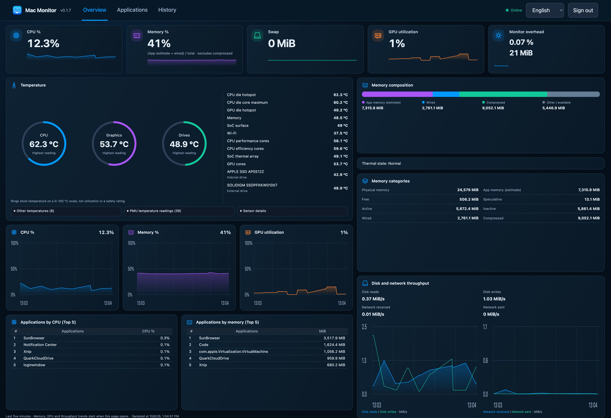

# Mac Monitor

A lightweight macOS monitoring app with a native controller and a responsive web dashboard.

- Monitor CPU, GPU, memory, temperatures, disk and network activity.
- View application resource rankings and historical data.
- Access the dashboard locally or over your LAN with HTTPS.
- Choose English, Simplified Chinese or Traditional Chinese.



## Requirements

macOS 14 or later. Apple Silicon is the target platform; the Intel package is available for development testing. No Node.js, Homebrew or other development tools are needed to use the app.

Sensor availability varies by Mac model and drive connection.

## Install

Download and install [v0.1.9](https://github.com/cloudshadow/mac-monitor/releases/tag/v0.1.9) with the commands below. Run them in Terminal using your regular macOS account; the installer selects your architecture, verifies checksums and requests administrator authorization.

```bash
(
  set -e
  cd "$HOME"
  curl -fL https://github.com/cloudshadow/mac-monitor/releases/download/v0.1.9/install.sh -o install-0.1.9.sh
  echo "42ed04b1e15b6a87ad68d1439753a66004720c971235aba225a591c029f7969f  install-0.1.9.sh" | shasum -a 256 -c -
  case "$(uname -m)" in
    arm64) checksum=80db44367dc2bac74c1ab53694b4e82624977e21d7c6b061ad48fbe56ec8d05e ;;
    x86_64) checksum=23f9592320f60353992276ce2657f5ef0cec1bbe134138b2dc71dac6361c9792 ;;
    *) echo "Unsupported architecture"; exit 1 ;;
  esac
  bash install-0.1.9.sh 0.1.9 https://github.com/cloudshadow/mac-monitor/releases/download/v0.1.9 "$checksum"
)
```

After installation, open **Mac Monitor** from Applications, or run:

```bash
open "/Applications/Mac Monitor.app"
```

The app uses ad-hoc signing, so macOS may require first-launch approval. See the [installation guide](docs/installation.md) for offline installation and troubleshooting.

## Use

1. Open the app and choose **Open monitor**.
2. Create your account on the local dashboard when you first use it.
3. Use **Overview**, **Applications** and **History** to view your metrics.
4. For another device on the same network, use the LAN address shown in the app and follow the [HTTPS setup guide](docs/mobile-setup.md).

Closing the app window keeps monitoring active. Quitting with ⌘Q stops the current session. Service startup and launch at boot are controlled separately in the app.

The memory percentage uses `(App estimate + Wired) / total`, excluding compressed memory. Temperature rings show readings in °C, rather than utilization.

## Update

Choose **Check for updates** in the app and run the provided installation command. Updates preserve your account, history and service-start preferences.

## Development

See [CONTRIBUTING.md](CONTRIBUTING.md) for build and test commands, and [the performance guide](docs/performance.md) for benchmarks.

## Licensing

No project license has been granted yet. Dependency licenses are listed in [THIRD_PARTY_NOTICES.md](THIRD_PARTY_NOTICES.md).
