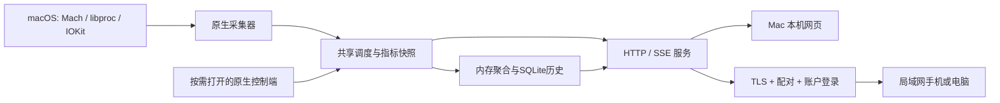

# Implementation Plan: Mac 硬件与应用资源监测

**Feature**: `001-hardware-monitor` | **Date**: 2026-09-30 | **Spec**: [spec.md](spec.md)
**Status**: 2026-10-03 已开始 Phase 1 工程和能力/性能/授权探针实现；真机门槛仍未通过，详见 tasks.md 和 docs/。未切换工作区 Git 分支。

**执行调整（2026-10-03，用户明确授权）**：继续完成全部代码，目标机实测由用户在实现完成后执行。G0～G4 保留为验收/发行门槛，不再阻塞代码和完整 UI 开发；不得将延期验证写成通过。软件计算、认证、存储和协议测试仍在开发时执行。

## Summary

单个 Swift 原生系统域LaunchDaemon业务服务（以指定普通用户身份运行）持续调用 macOS 接口，系统1秒、应用4秒，与查看者数量无关；聚合并缓存指标，向浏览器提供静态网页与 SSE 数据流。最近五分钟优先内存，较早数据读SQLite，详见 [realtime-data-flow.md](realtime-data-flow.md)。
支持本机和局域网配对设备的账户登录；React + TypeScript + Vite构建静态网页。内嵌SQLite批量保存30天系统历史与7天应用摘要，减少采集、写盘和页面渲染频率。
目标为所有 M 系列基础监测；温度/GPU 必须有每个芯片与 macOS 版本的能力记录。



## Technical Context

- **Language/Version**: Swift 6 工具链，macOS 14+ arm64；前端 React + TypeScript + Vite。实现时锁定工具链和依赖版本。
- **Primary Dependencies**: Foundation、Darwin/Mach、IOKit、libproc C shim；SwiftNIO 的 NIOHTTP1/NIOPosix、NIOSSL。内嵌SQLite C库、libsodium的Argon2id密码验证；前端React/ReactDOM、TypeScript、Vite，Canvas绘图。依赖版本与许可在实现时锁定。
- **Storage**: 有界实时缓存；`history.sqlite`保存分级历史，`state.sqlite`保存唯一账户/设备/普通设置，历史开关及epoch在history.sqlite同库保存，TLS私钥放系统专用secrets目录，独立于登录钥匙串。无需数据库进程或单独安装。详见 [history-storage.md](history-storage.md)。
- **Testing**: Swift Testing/XCTest；浏览器端到端场景；独立性能测量程序。以具体计数、权限、安全和生命周期风险为重点。
- **Target Platform**: 所有 M 系列，macOS 14+；能力按运行时探测。首批验证基础 M1 8GB、至少一种 Pro/Max 和可借用的最新基础款，其他组合明确列为未验证。
- **Project Type**: 系统级LaunchDaemon + 静态Web UI + 按需控制端/特权维护工具。
- **Performance Goals**: 以 spec SC-001/002/005 为唯一数值验收源。
- **Constraints**: system域任务通过UserName指定普通服务所有者UID，安装与系统维护按需管理员授权；不引入常驻Node/Python/Electron或独立数据库服务；SQLite库嵌入Agent进程。SSE 上限 3 个；进程追踪上限 4,096；内存有界。
- **Scale/Scope**: 单台Mac，1–3个观看者；30天系统历史、7天应用摘要、最多64条系统序列及每应用桶30组。

## Constitution Check

| 原则 | 设计前检查 | 设计后检查 |
| --- | --- | --- |
| 可测量低占用 | 定义后台与网页预算 | quickstart覆盖默认持久历史、0/1/3客户端、登录瞬态、24h与高进程数 |
| 真实数据 | 区分缺失与零 | Metric 状态、CPU 口径和兼容矩阵已设计 |
| 按需且有界 | 持续单次采集共享，按需传输 | 有界近期缓存、电源降频、慢连接策略；新频率须重新验收 |
| 数据留在设备 | 本机/LAN | TLS、一次性配对、撤销；无外部依赖服务 |
| 最小架构 | 单原生服务 | SQLite为已确认历史需求提供嵌入式持久化；依赖基线先测 |

以上是设计符合性，运行时性能和硬件支持仍待验证。

## Phase 0: Research and feasibility gates

研究结论及一手来源见 [research.md](research.md)。按本轮用户授权先完成全部软件，G0/G4 及其余真机探针留到发行前验收；共五个门槛：

1. **G0 基础与性能**：system域普通UID、无桌面会话下原生CPU/内存 + 500进程扫描 + NIO/NIOSSL和SQLite基线；测默认历史开启后的实际预算。未达标先定位依赖/采样成本，不开展完整 UI。
2. **G1 温度与 GPU**：M1 和至少一款不同代 M 系列验证 SMC/HID/IORegistry；记录权限、传感器映射、耗时和失败行为。未知传感器不得自行标成 CPU 温度。
3. **G2 手机配对**：Safari iOS 和另一桌面浏览器实测证书安装、主机名解析、TLS、Cookie、SSE 后台恢复。证书信任须给出实际可执行步骤，失败时不能默默退回明文。

4. **G3 历史与账户**：验证FULL同步的分钟事务、整点聚合、30天容量、历史查询限时以及Argon2id登录峰值；不以空数据库/关闭历史的结果代替完整配置预算。

5. **G4 免费分发与系统授权（提前）**：T004先做最小ad-hoc原生控制端、固定维护工具及system plist原型，验证NSAppleScript管理员授权/取消、sudo引导安装、普通UID无桌面运行、enable/start/disable/stop及卸载；记录最低支持与当前macOS结果。GUI授权失败阻塞完整安装承诺，不推迟到T041才发现。具体流程见launchdaemon。

发布门槛：温度是核心需求，主支持机型必须有可用且已验证的摄氏度来源；只显示 thermalState 的版本仅可称为基础监测预览版。

## Phase 1: Architecture and collection

### 采集能力与来源

| 指标 | 来源候选 | 展示与边界 |
| --- | --- | --- |
| 整机/每核 CPU | host_statistics / host_processor_info 差分 | 总体 0–100%；返回的 Mach 缓冲必须释放 |
| 系统内存 | host_statistics64、hw.memsize、交换区接口 | 原始分类、非空闲占比；不可把缓存都叫不可回收内存 |
| 应用 CPU/内存 | proc_listallpids、proc_pidinfo、proc_pid_rusage | 以 PID+启动时间识别；phys_footprint 为主、RSS 为辅 |
| 应用磁盘 | rusage 的累计读写字节差分 | 进程 I/O 记账口径，不能保证等于物理磁盘活动 |
| 系统磁盘 | IOKit 存储设备统计 | 按叶子物理设备去重；缺字段则降级 |
| 系统网络 | getifaddrs 的接口计数器/系统路由接口 | 每接口字节差分；默认选活跃物理接口，不叠加隧道 |
| 温度 | 按机型验证的 AppleSMC / IOHID 适配器 | 只读；传感器名、单位、聚合方式与验证状态必须可见 |
| 系统热状态 | ProcessInfo.thermalState | 正常/较热/严重/临界，绝不换算 °C |
| GPU 总体 | IORegistry 驱动统计，必要时研究 IOReport | 实验适配、按机型验证；不冒充通用公开稳定契约 |
| 逐应用 GPU/网络 | 后续独立能力探针 | 首版返回 unsupported；不估造数据 |

### CPU 和内存口径

- 进程 CPU 单核口径 = 100 × Δ(userTime + systemTime) / Δ单调时间；可超过 100%。适配层统一原始时间单位为纳秒。
- 进程 CPU 整机口径 = 单核口径 / 当前逻辑核数。整机 CPU 由 CPU tick 计算，不能简单把可见进程相加。
- 单个应用是互斥成员集合；只累加进程自身计数，不能再次累加 child 时间。CPU 相对整机已用量的份额若提供，分母接近零时返回不可用。
- 内存主指标为物理总量、free、speculative、active、inactive、wired、compressor；类别可能有关系，UI 不强行堆叠成完美分区。
- “非空闲内存占比”定义为 (total − free − speculative) / total，明确包含可回收内存，不等同于活动监视器 Memory Used。
- 应用内存占物理总量比例 = 进程 footprint 聚合 / total；聚合显示“估算”，跨进程共享账务与系统内存不可强制配平。
- 压力通过可用的系统压力接口/Dispatch 内存压力通知显示级别；初始无法确定时 unknown，不用 free% 伪造压力。

### 采样调度

| 状态 | CPU/内存/系统 I/O | 应用扫描 | 温度/GPU | 推送 |
| --- | --- | --- | --- | --- |
| 页面可见 | 1s | 4s | 10s / 5s | 系统1s、应用4s，按频道共享 |
| 所有页面隐藏/断开 | 1s | 4s | 10s / 5s | 无，采集与历史继续 |
| 低电量模式或严重热状态 | 5s | 10s | 20s / 10s | 可见时按新周期并提示 |
| 睡眠 | 暂停 | 暂停 | 暂停 | 断流 |

采用一个协调调度器、允许约 10% leeway 的定时器及后台 QoS。使用单个 NIO event loop 和独立串行采样队列，禁止在 event loop 里遍历进程或读取传感器。一次采样、多客户端复用；有订阅时按频道共享编码，无订阅不编码/推送。客户端请求不触发硬件采集；不同页面只订阅所需频道。

进程差分每轮覆盖所有可读取进程，不能只重采 Top 20 而永远漏掉新热点。名字/路径/归属只在新身份出现时查询并缓存；通过 可验证进程可执行路径、bundle元信息和有证据的辅助进程关系归组；NSRunningApplication等GUI信息仅为可选补充，不依赖桌面会话，父进程只作线索。未知 XPC 服务保持未归属。

每次扫描 CPU 时间预算 10ms（500 进程参考规模），超过则报告 degraded 并调整间隔，不并发堆积扫描。大进程数采用分批扫描，记录每进程时间窗与整轮覆盖；2,000 进程验证需保证 30 秒内完成覆盖或明确报告无法达标。

失败适配器采用退避（30s、60s、最多 5min），连续 3 次失败暂停并允许手动重试。潜在阻塞接口必须先完成耗时探针；不可取消的系统调用不能声称有硬超时保证。发现真实挂死风险时再设计独立 helper，并重新验收总预算。

### 历史、传输和React界面

- 实时内存保留最近至少5分钟及至多1分钟衔接余量，每条最多360个1秒槽，上限64序列；应用近期90帧、每帧Top并集最多30组，近期缓冲合计硬上限4MiB。取消原额外55分钟内存层。持久历史按1m/24h、5m/7d、1h/30d分层，应用每5分钟最多30组保留7天；实现规则见 [history-storage.md](history-storage.md)。
- 每60秒合并系统样本入一个SQLite事务，应用5分钟最终桶复用同一写入节奏；FIFO有界，查询限时，磁盘错误单独降级。无查看者仍4秒扫描进程，1秒系统采样；性能预算按此新配置重新验证，不能沿用旧低频结果。
- SSE的system/capabilities推送最新快照；apps仅推送≤2KiB的scanSequence通知，各页面按自身排序/筛选从共享缓存GET分页。只保存当前应用扫描表，旧游标409；首页实时、翻页暂停替换并提示新数据，查询并发/限流见契约。bootId+sequence防止旧消息覆盖；每连接待发送最多128KiB，慢连接断开。历史走独立有界HTTP查询，不用SSE回放全部历史。
- 历史系统查询按需加权合并成2h等更粗桶，每序列所有segment/连续段合计≤600点，无法满足返回pointBudgetTooSmall；行数仅作单segment名义估算，实际执行256MiB预算。pause保持近期内存，clear通过history.sqlite内recordingEpoch和串行屏障清除旧队列/缓冲，避免清空后数据重现。
- React + TypeScript + Vite。React组件负责页面/表单/排行；采样数据用外部store按选择器订阅，通过useSyncExternalStore等方式限制更新范围。Canvas图表只在新数据/尺寸变化时重绘，不保持60fps动画。
- 初始显示Top20、最多100行/页；历史与设置页代码按路由懒加载，优先不引入大型组件库/图表库。JS+CSS首屏gzip目标≤200KiB（含React基础代码，一种语言），全部首版静态脚本/样式目标≤400KiB；文件大小不代替CPU/内存验收。
- Vite只用于开发与打包；`web/dist`随.app提供。用户机器无Node、dev server或SSR进程。原生服务只读取本地静态资源，无CDN依赖。
- 页面hidden时关闭SSE并停止历史轮询/续租，visible时获取新快照；服务端35秒租约过期兜底。切换语言不重建store/订阅；显示明确的时间、分辨率、覆盖和缺口。
- 语言资源使用根目录 `locales/{tag}/{namespace}.json` 和各语言 `locale.json`；首版 `zh-Hans / zh-Hant / en`。构建扫描自动生成语言注册表、TypeScript 键/参数类型及原生 `Localizable.xcstrings`，翻译者只维护 JSON。浏览器语言匹配、英语回退、复数/参数校验和新增语言步骤见 [localization.md](localization.md)。资源按页面/语言加载，应用字典缓存限当前语言及英语，首屏预算包含回退资源；切换不重建订阅或清空表单。服务端返回稳定 error.code，前端翻译，message 仅用于诊断；原生引导使用同一翻译源。

### 单账户认证

首次打开未初始化的本机页面显示创建账户；必须具备原生控制端通过服务所有者控制通道取得的短效setup票据，不能仅凭来自127.0.0.1就抢先注册。唯一账户表使用`id=1`约束，事务内创建并再次检查；禁止第二账户。创建成功后再允许LAN开启。

密码12～128个Unicode字符、UTF-8最多512字节，允许空格，不截断或修改密码；用户名1～64字符并规则化供比较。采用libsodium Argon2id，初始64MiB内存及交互参数，参考机测量后锁定；只在创建/登录/修改时执行。全局仅1个KDF任务、最多2个排队，重试每IP5次/分钟且全局10次/分钟，队列满返回429。登录的短时高CPU/内存另测并显示，不为低采样预算降低密码保护。

账户会话使用256-bit随机token，服务端只存散列；默认12小时到期，重启需重新登录。LAN还需要独立30天设备资格，两者同时有效才可读实时/历史。配对只授予设备资格；修改/恢复密码提升authEpoch，撤销全部账户会话与SSE，不自动删除历史。注销只撤销对应会话。所有流定期且在撤销事件时重新校验，5秒内停止。

状态库损坏时仅本机进入恢复，禁止自动回到“创建账户”。密码恢复走服务所有者UID受保护控制通道；备份恢复撤销旧会话并要求重新确认设备资格。详细实体与路由见data-model与contracts。

### 局域网与生命周期

- 本机默认只监听 127.0.0.1 / ::1。LAN 显式开启后，仅监听所选 LAN 接口地址，TLS 1.2+；不绑定所有接口，不配置公网端口映射。
- 本机控制端展示可复制地址/二维码。本机8765、LAN8766不可用时自动选端口并打开/展示实际地址；用受限本地控制通道验证服务身份。稳定 .local 主机名优先，同时展示当前 IP；证书 SAN 必须对应实际访问地址。接口/IP 变化要重绑定，必要时轮换证书并说明重新信任。
- 证书只在初始化/轮换时生成。原型可使用系统 openssl 一次性生成专用本地 CA/服务器证书，配合受限私钥存储；真机验证系统工具兼容后封装。CA 信任由用户在自己的客户端完成；不引导跳过浏览器校验。
- 配对凭据 128-bit 随机、一次使用、5 分钟过期，从二维码 URL fragment 读取后清除 URL，再POST换取设备资格；不得写入日志。设备资格30天过期，与12小时账户会话分开，可本机逐设备撤销。
- LAN Cookie 为 HttpOnly、Secure、SameSite=Strict；本机 HTTP 使用独立 loopback 会话。按契约请求类型校验Host/Origin，不开放CORS；同源GET/SSE允许缺Origin但仍认证，写请求必须正确Origin及适用的CSRF/一次票据。设置、签发配对码、撤销设备通过验证安装时绑定的服务所有者UID的本地控制通道操作。
- 原生控制端按需启动和退出；系统启动域LaunchDaemon在未登录桌面及用户注销后持续运行，UserName绑定普通服务所有者。安装器经管理员授权写入系统启动任务，按需特权工具处理系统启停/升级/卸载，无常驻root网络服务。新安装默认bootEnabled=true、升级保留禁用选择；启动状态和进程健康分开报告，受限异常恢复；start仅启动已启用任务，enable启用并启动，disable保留本次运行，stop先禁用、prepareStop刷盘就绪后再bootout。图形端以NSAppleScript管理员授权调用固定维护工具，G4提前验证免费ad-hoc兼容性。系统路径、peer UID、TLS秘密、FileVault边界及无GUI验收见 [launchdaemon.md](launchdaemon.md)。
- 首选免费一行命令下载、校验、经管理员授权安装预编译ad-hoc .app至系统Applications，随包提供所有运行资源；无需Apple付费身份、Docker或数据库安装。首次打开可能需系统批准，创建账户后进入本机页面；LaunchDaemon开机启动默认启用、可通过管理员授权关闭，LAN仍默认关闭。公证DMG为后续可选渠道。传感器接口与沙盒限制需验证，第一版不以 Mac App Store 为发布门槛；不关闭 SIP。
- 首版提供按需检查更新、复制指定版本安装命令和图形化停止清理入口；同一安装器负责校验、升级及失败恢复，更新须协调Agent停止与恢复。Sparkle/公证更新为后续可选，不引入首版。详细数据目录、恢复边界和验收见 [installation-and-storage.md](installation-and-storage.md)。

## Project Structure

```text
.specify/                         # Spec Kit 项目与宪章
specs/001-hardware-monitor/        # 本次需求、设计、契约、验收与任务
Package.swift                     # 工程/基础桥/探针已建立；业务模块按 tasks.md 推进
Sources/MonitorCore/               # 模型、调度、缓冲、应用归属
Sources/MacCollectors/             # CPU、内存、进程、I/O、传感器
Sources/CMacBridge/                # 最小 libproc/IOKit C 桥
Sources/MonitorServer/             # NIO HTTP/SSE、认证与 TLS
Sources/MonitorAgent/              # 服务入口
Sources/MonitorControl/            # 按需原生控制端
Sources/MonitorMaintenance/        # 按需管理员授权的有限系统管理工具
Resources/LaunchDaemons/           # system域启动任务plist
Sources/HistoryStore/              # SQLite、聚合、保留清理
locales/                          # 各语言元信息及按功能划分的JSON；翻译唯一源
web/src/                          # React页面、TS store、i18n加载器与Canvas图表
Tests/                            # 计算、契约、生命周期
Tools/CapabilityProbe/             # 真机能力报告
Tools/Benchmark/                   # 外部低开销测量程序
scripts/                          # 构建、打包、验收
scripts/i18n/                     # 翻译校验、自动注册、TS类型及原生资源生成
```

## Complexity Tracking

无宪章例外。NIO/NIOSSL用于HTTP/TLS，SQLite用于明确的历史需求，libsodium用于密码验证；均嵌入现有进程。先测稳定开销和登录峰值，再决定是否调整实现。Swift 与 Rust 都可低占用；本设计选 Swift 的理由是 macOS 接口整合成本，并非未经测试的性能优越性。

## 开源与发行

首选免费预编译包与公开一行安装器；开发、首版打包和安装验证均不依赖Apple付费身份。公证DMG为可选后续渠道，不是首版门槛；源码许可证建议MIT，发布前确定。流程见 [free-command-install.md](free-command-install.md) 与 [signing-and-open-source.md](signing-and-open-source.md)。当前仅有开发工程与探针，没有可用公开安装链接。
