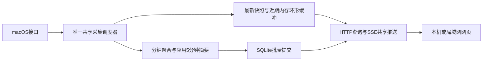

# 持续采集、近期内存与网页实时显示

**Updated**: 2026-10-01。用户明确持续共享采集、近期五分钟读内存、免费命令安装优先；系统10秒/应用10秒作为本轮待真机验证的默认设计。当前无应用实现。

## 数据流及采样

LaunchDaemon启动且数据卷可用、Mac唤醒时持续采集，与桌面登录/注销无关，与客户端数量及页面可见性无关。默认系统CPU/内存/磁盘/网络1秒，所有可读取进程扫描4秒；温度10秒、GPU10秒，不将慢传感器也提高到1秒。所有接口只读共享结果，连接、刷新及查询不触发新采集。不同客户端可有不同排行排序，但使用同一轮采样。system通过SSE发快照；apps只发≤2KiB扫描版本通知，页面从当前共享表GET所需排行，不发送完整4096行。首页每新扫描至多一次刷新，每页1在途请求；翻页保留当前显示，版本失效提示并回最新首页，详见HTTP契约。

无查看者停止编码/推送，仍按上述频率采集、更新内存和历史。低电量或严重热状态可显式降为系统5秒、应用10秒、温度20秒、GPU10秒；睡眠暂停，恢复重建速率基线。接口异常独立退避，超预算无并发堆积，实际间隔和原因必须显示。取消“无查看者自动15秒/60秒”的旧规则。

第一轮即可显示内存观测值；CPU/磁盘/网络等差分指标需要第二轮。正常运行时初次请求直接取最新缓存，正常默认频率下目标3秒内显示基础指标；冷启动CPU约第二轮后可用，应用差分约第二轮后可用。页面加载不要求数据库先完成大范围历史查询。

## 频率提高的影响与性能门槛

相对于原无人查看系统15秒/应用60秒，两类调用次数各变为15倍；相对于原可见系统2秒/应用5秒，分别为2倍、1.25倍。它们不是整个进程CPU倍数，实际成本还包括固定服务基线、各接口耗时、聚合、网络和网页渲染。

若平均每轮全进程扫描花费 `c` 毫秒CPU，4秒一次仅扫描部分的单核占用约为 `c / 40 %`；例如10ms约0.25%，已超过原无人查看总目标0.2%，还未计系统采样及其他工作。10ms为旧单轮预算上限，不是测得的平均耗时。原 spec 性能目标暂不放宽，但必须在1秒/4秒配置重新验收；无法达到时报告具体成本并调整设计/目标，不能拿15秒/60秒数据宣称达标。

有界环形缓冲令内存保持固定，但更密集样本会增加缓冲需求、CPU及唤醒；功耗不能仅靠平均CPU推断。分钟事务、系统存储精度和应用5分钟摘要不变，因此不按15倍增加持久行数/提交次数，真实物理写入仍须测量。客户端只增加传输、连接、查询、编码变体及自身渲染成本，不增加硬件采集次数。首版仍最多3个活动流，不承诺无限客户端零成本。

## 近期内存与数据库分工

“最近五分钟优先读内存”是读取策略，不意味着等五分钟后才第一次写盘。系统仍每60秒批量提交聚合结果，应用仍在每个5分钟窗口结束提交最终摘要；已落盘数据可以同时留在内存。这样不把系统崩溃丢失窗口扩大到五分钟。

- 系统近期序列保留至少5分钟，额外最多60秒供分钟边界衔接；每序列最多360个1秒槽、最多64序列。温度/GPU只保留真实采样点，不复制旧读数充当新样本；低频、睡眠和失败槽为缺口。
- 应用当前排行仍使用当前轮完整有界结果（最多4096身份）。近期历史帧每4秒取CPU、内存、磁盘合计各Top10的并集，最多30组；最多90帧，保留最多6分钟。它不代表所有应用的完整4秒历史，未入榜为notRetained。5分钟持久最终排行从所有有界观测累积中独立选取，不只累积近期帧入榜者。
- 近期系统与应用帧采用紧凑字段、共享元信息引用，合计字节硬上限4MiB；不得保存每帧JSON/完整4096进程副本。另有当前进程表、写队列等，全部纳入总footprint。若边界保留不足或提前淘汰，返回实际可用范围并显式降级，不承诺固定窗口仍完整。
- 超过近期范围的查询读SQLite：系统1分钟/24小时、5分钟/7天、1小时/30天；应用5分钟/7天。内存秒级明细不是长期永久保存，重启后仅能回看已提交的聚合精度。

统一查询以一次捕获的recordingEpoch、segment、快照版本、内存覆盖和提交水位为依据。系统默认在 `floor((now-5min)/1min)` 切分，利用最多1分钟的额外内存覆盖：数据库返回边界前完整桶，内存返回边界及之后点。应用在已提交5分钟桶边界切分，并要求内存确实覆盖该边界；否则回退已提交摘要或标记未提交缺口。每段返回source、resolution、coverage、range和segmentId，不把粗粒度桶伪装为秒级；同一时间范围不重复展示两份。

冷启动、重启、故障、内存实际覆盖不足时优先利用有覆盖的已提交聚合桶，返回分段精度；不存在的区间为空。时钟回拨按segment分开，不跨segment拼成虚假连续时间。边界后的粗粒度fallback若采用，需整段替代相交的高精度范围，禁止重复计数。内存读取有短时有界拷贝，数据库查询在独立队列，均不持有采样锁等待磁盘。

暂停历史仅停止持久保存，近期环形缓冲继续更新且标persisted=false；恢复不回填暂停区间。清空同时清理历史数据库、近期缓冲、未提交聚合和队列，保留当前实时值；epoch切换使旧查询失效，客户端收到新epoch清空旧曲线。严格控制顺序见 [history-storage.md](history-storage.md)。系统长范围查询可临时合并成2h等精度；每序列所有分段合计≤maxPoints，不能靠截掉旧时间范围满足600点。

## 网页启动、401与断线

1. 加载静态页面与语言，查询 `/api/v1/auth/status`：明确返回setupRequired、recoveryRequired、pairingRequired、loginRequired或authenticated。LAN未完成本机初始化时仅提示回Mac完成设置，不开放远程创建。
2. 已登录页面通过 `/api/v1/auth/session` 恢复CSRF token（有效账户会话，LAN还需设备资格；仅同源可读、no-store），解决刷新后token丢失。setup/login也返回CSRF token。只在JS内存保存token。
3. 同时获取能力、当前快照及近期历史，创建有限viewer后建立SSE。最多3个活动流、viewer总数最多6个且35秒过期；全部viewer操作绑定当前账户会话及LAN设备，创建也需CSRF。租约只控制网络推送，不控制采集频率。
4. 普通HTTP请求返回401，由统一前端处理器关闭连接、取消重试、清空受保护页面数据并导航登录页，保留语言；错误密码停留登录页并提示。403根据稳定错误码提示配对/权限问题，不统统导航登录。
5. 原生EventSource错误事件不提供HTTP状态码。出错关闭旧流，唯一连接管理器按1/2/4/8/最多30秒退避，以一次同源认证/会话请求判明401、设备资格失效或网络失败。只有认证确认失效才导航登录；离线显示重连。429等待retryAfter，不反复登录。
6. 已打开的SSE响应不能中途变成HTTP401；服务端撤销时先禁止数据发送，可best-effort发送不含指标的authExpired事件并关闭流，客户端再核验状态，5秒撤销上限不变。不能依赖事件一定送达。
7. API/SSE不重定向到HTML登录页。HTTP重定向作用于该子请求，不会替代前端顶层页面导航；页面路由切换统一由前端完成。原生EventSource内置重连在onerror时通过close终止，避免两套重连并行。

连接状态与指标有效性分开。客户端根据响应serverTime、ageMs/单调elapsed和本地单调时钟推进数据年龄，不直接用手机墙钟减Mac墙钟；断流立即显示连接异常，超过各指标stale阈值标记过期。前端可见时复用最多每秒一次的刷新检查，hidden暂停；恢复可见重新校验会话并拉取共享快照/近期历史。切换语言不重连。

## SSE和WebSocket的决定

首版保留SSE：本产品以服务端向浏览器推送为主，登录、历史和设置使用普通HTTP。SSE是持续HTTP流，不是一秒发起一次HTTP请求；WebSocket支持同一连接双向消息及二进制。两者都能共享采集结果、保持低延迟，也都必须处理认证失效、断网、消息积压和有界连接。

WebSocket可减少部分消息封装、承载高频双向命令，但不能据此断言本项目CPU/内存更低；应用级重连、恢复序号、心跳与过期协议仍需实现。WebSocket连接建立后也没有逐消息HTTP401；握手失败也不保证浏览器JS能读出401。因此更换协议不能自动解决登录跳转。若后续出现高频双向交互或二进制吞吐需求，再以相同负载实测比较。

依据：[HTML SSE标准](https://html.spec.whatwg.org/dev/server-sent-events.html)、[EventSource错误事件](https://developer.mozilla.org/en-US/docs/Web/API/EventSource/error_event)、[WebSocket标准](https://websockets.spec.whatwg.org/)。

## 验收补充

在0/1/3客户端各运行同样时长，核对默认每分钟约60次系统采样及15轮进程扫描（允许调度误差，睡眠/显式降频另记），连接/刷新不增加采集轮数。验证近期内存命中、跨库边界不重叠、重启回退聚合精度、内存字节上限和缺口。验证刷新恢复CSRF、401导航、断网不误登出、配对过期、租约重建、慢流与重复连接清理；性能使用新默认频率重测。

## 2026-10-03 stop and sampling revision

用户明确要求 ⌘Q 退出停止 Agent：关闭窗口仍保留后台运行，但显式退出通过服务所有者 IPC 请求 shutdown，确认实际 PID 退出，失败保留控制窗口并显示错误；正常退出状态为 0，KeepAlive/SuccessfulExit=false 不重新拉起。保留开机启动偏好；用户注销／系统退出不误触发手动停止。默认系统、进程、温度、GPU 全部每 10 秒采集一次，低电量／严重热限制为 20 秒；SMART 保持 60 秒缓存。SMC 每批复用一个连接并缓存可读 key。温度命名参考用户指定 MacMonitor 的 M2 SENSORS.md；CPU／GPU 芯片、SoC、邻近、内存及 VRM 明确区分，不宣称已验证此项目的全部机型。
